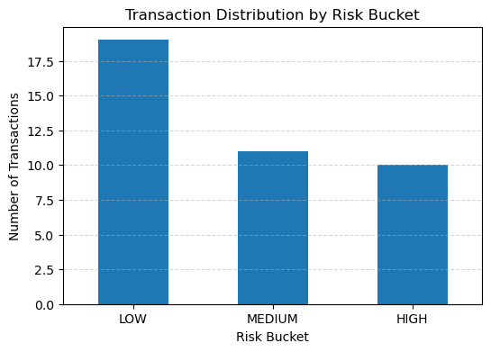
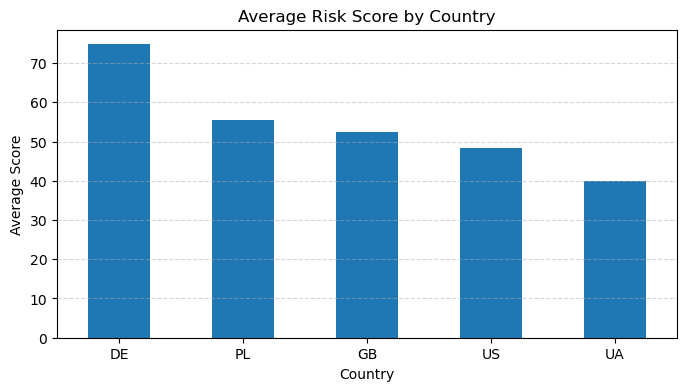

# Fraud Risk Prototype (Python + SQL)

# Fraud Risk Scoring Prototype

A mini fraud-risk scoring system built with Python and SQLite.

This project demonstrates how transaction data can be stored, processed, scored, and analyzed using rule-based risk logic in a structured end-to-end pipeline.

---

## 📌 Project Overview

The system:

- Stores customers and transactions in a SQLite database  
- Loads and joins data using SQL  
- Applies rule-based fraud scoring  
- Assigns a risk bucket (LOW / MEDIUM / HIGH)  
- Generates explainable reason codes  
- Writes scoring results back to the database  
- Provides analytical summaries and visualizations  

---

## ⚙️ Tech Stack

- Python  
- SQLite  
- Pandas  
- Matplotlib  

---

## 🗂 Project Structure

- `analysis.py` – runs the full pipeline (data → scoring → storage)  
- `src/fraud_risk/db.py` – database schema and queries  
- `src/fraud_risk/data_prep.py` – data generation and loading  
- `src/fraud_risk/model.py` – scoring logic and risk rules  
- `src/fraud_risk/config.py` – thresholds and rule parameters  
- `fraud.db` – generated SQLite database  

---

## 🧠 Risk Scoring Logic

Risk score is calculated based on:

- Base score from transaction amount  
- High amount bonus  
- Night-time transaction bonus (00:00–05:59)  
- New customer bonus  
- Non-UA country bonus  

Risk bucket classification:

- LOW – score < 50  
- MEDIUM – 50–79  
- HIGH – 80+  

Each transaction includes explainable reason codes for transparency.

---

## 📊 Visualizations

### Transaction Distribution by Risk Bucket


### Average Risk Score by Country


---

## ▶ How to Run

```bash
python analysis.py